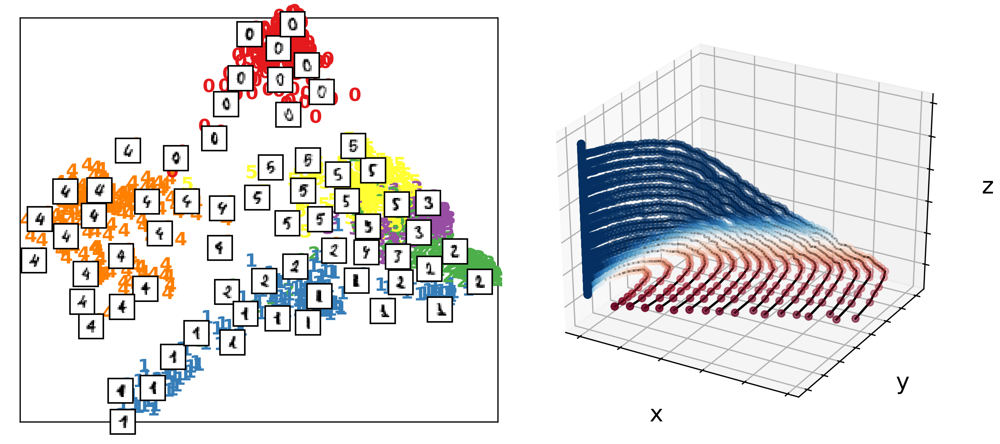

Introduction
============

Ever increasing data availability has changed the way how data is
analyzed and interpreted in many scientific fields. While the underlying
complex systems remain the same, data measurements increase in both
quantity and dimension. The main drivers are larger computer simulation
capabilities and increasingly versatile sensors. In contrast to an
equation-driven workflow, a scientist can use data-driven models to
analyze a wider range of systems, including those with unknown or
intractable equations. The models can be applied to a variety of
data-driven scenarios, such as enriching the analysis of unknown systems
or merely serve as an equation-free surrogate by providing fast, albeit
approximate, responses to unseen data.

However, expanding datasets create challenges throughout the analysis
workflow from extracting and processing to interpreting the data. This
includes the fact that new data does not always provide completely new
and uncorrelated information to existing data. One way to extract the
essential information is to understand and parametrize the intrinsic
data geometry. An intrinsic geometry is what most data-driven models
assume implicitly or explicitly in the available data, and successful
machine learning algorithms adapt to this underlying structure for tasks
like regression or classification (e.g., :cite:`bishop_pattern_2006`). This geometry is
often of much lower dimension than the ambient data space, and finding a
suitable set of coordinates can reduce the complexity of the dataset. We
refer to this geometric structure encoded in the data as a "manifold".
In mathematical terms, a manifold is a topological space that is locally
homeomorphic to Euclidean space. Typically, manifold learning attempts
to construct a global parametrization (embedding) of this manifold, in a
space of much lower dimension than the original ambient space. The
well-known manifold hypothesis states that such manifolds underlie many
observations and processes, including time-dependent systems.

*datafold* is a Python package that provides **data**-driven models for
point clouds to find an *explicit* mani-\ **fold** parametrization and
to identify non-linear dynamical systems on these manifolds. The
explicit data manifold treatment allows prior knowledge of a system and
its problem-specific domain to be included. This can be the proximity
between points in the dataset :cite:`coifman_diffusion_2006` or functions defined on the
phase space manifold of a dynamical system, such as (partially) known
governing equation terms :cite:`williams_datadriven_2015`, :cite:`brunton_discovering_2016`.

*datafold* is open-source software with a design that reflects a
workflow hierarchy: from low-level data structures and algorithms to
high-level meta-models intended to solve complex machine learning tasks.
The key benefit of *datafold* is that it accommodates and integrates
models on the different workflow levels. Each model has been
investigated and tested individually and found to be useful by the
scientific community. In *datafold* these models can be used in a single
processing pipeline. Our integrated workflow facilitates the application
of data-driven analysis and thus has the potential to boost widespread
utilization. The implemented models are integrated into a software
architecture with a clear modularization and an API that is templated
from the ``scikit-learn`` project, which can be used as part of its
processing pipeline :cite:`pedregosa_scikit-learn_2011`.
The data structures are subclasses from common objects of the Python scientific
computing stack, allowing models to generalize for both static point clouds and
temporally ordered time series collection data. The software design and modularity in
*datafold* reflects two requirements: high flexibility to test model
configurations, and openness to new model implementations with clear and
well-defined scope. We want to support active research in data-driven
analysis with manifold context and thus target students, researchers and
experienced practitioners from different fields of dataset analysis.

   (Left) Point cloud of embedded handwritten digits between 0 and
   5 with the "Diffusion Map" model. Each point originally has 64
   dimensions where each dimension represents a pixel of an 8 x 8 image.
   (Right) Conceptual illustration of a three-dimensional time series
   forming a phase space with geometrical structure. The time series
   start on the ``(x,y)`` plane and end on the ``z``-axis.

1. Point cloud data
-------------------

High-dimensional and unordered point clouds are often directly connected
to the "manifold assumption", i.e. that the data lies close to a
lower-dimensional manifold. Our software aims to find a low-dimensional
parametrization (embedding) of this manifold. In a machine learning
context, this is also referred to as "non-linear unsupervised learning"
or shorter "manifold learning". Often the models are endowed with a
kernel which encodes the proximity between data to preserve local
structures. Examples are the general "Kernel Principal Component
Analysis" :cite:`bengio_learning_2004`, "Local Linear Embedding"
:cite:`belkin_laplacian_2003`, or "Hessian Eigenmaps" :cite:`donoho_hessian_2003`. A
variety of manifold learning models already exist in the ``scikit-learn`` Python
package. In addition to these, *datafold* provides an efficient implementation of the
"Diffusion Maps" model :cite:`coifman_diffusion_2006`. The model includes an optional
sparse kernel matrix representation with which the model can scale to larger datasets. In
addition to non-linear dimension reduction, "Diffusion Maps" allow the
user to approximate mathematically meaningful objects on manifold data,
such as the Laplace-Beltrami operator :cite:`coifman_diffusion_2006`. *datafold* also
supplies functionality for follow up aspects of non-linear manifold
learning, such as estimating the kernel scale parameters to describe the
locality of points in a dataset and extending the embedding to unseen
data. The latter refers to the image and pre-image mapping between the
original and latent space (e.g., see analysis in :cite:`chiavazzo_reduced_2014`). This
so-called "out-of-sample" extension interpolates general function values
on manifold point clouds and, therefore, has to handle large input data
dimensions :cite:`coifman_geometric_2006`, :cite:`fernandez_auto-adaptative_2014`,
:cite:`rabin_heterogeneous_2012`. In *datafold*, out-of-sample extensions are
implemented efficiently, so that interpolated function values for
millions of points can be computed in seconds on a standard desktop computer.

2. Time series data
-------------------

A special kind of point cloud type targeted by *datafold* are time
series and collections thereof. In this case, a data-driven model can
fit and generalize the underlying dynamics to perform prediction or
regression. Usually, the phase space of the dynamical system, underlying
the time series observations, is assumed to be a manifold (see a
conceptual illustration in the figure.
*datafold* focuses on the algorithms "Dynamic Mode Decomposition" (DMD)
:cite:`schmid_dynamic_2010`, :cite:`tu_dynamic_2014`, :cite:`kutz_dynamic_2016`
and "Extended Dynamic Mode Decomposition" (E-DMD)
:cite:`williams_datadriven_2015`. DMD linearly decomposes the available time series
data into spatio-temporal components, which then define a linear
dynamical system. Many DMD based variants address even more general,
non-linear underlying dynamical systems. This is usually done by
changing the time series coordinates in a step before DMD is applied
:cite:`williams_datadriven_2015`, :cite:`champion_discovery_2019`,
:cite:`le_clainche_higher_2017`, :cite:`giannakis_data-driven_2019`.
The justification of this workflow is covered by operator theory and functional analysis,
specifically the Koopman operator. In practice, the E-DMD algorithm
approximates the Koopman operator with a matrix, based on a finite set
of functions evaluated on the available data, the so-called
"dictionary". Finding a good choice for the dictionary is comparable to
the machine learning task of "model selection" and requires great
flexibility in setting up the data processing pipeline. The flexibility
of setting an arbitrary dictionary combined with a selection of the
provided DMD variants is a core feature of *datafold's* implementation
of E-DMD.
