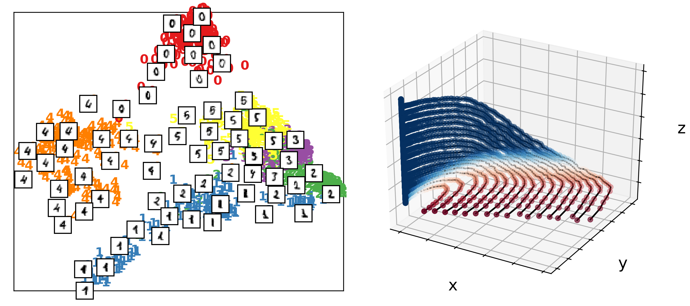

<!---
From:
https://joss.readthedocs.io/en/latest/submitting.html#what-should-my-paper-contain

Your paper should include:

* A list of the authors of the software and their affiliations, using the correct
 format (see the example below).
* A summary describing the high-level functionality and purpose of the software for a
 diverse, non-specialist audience.
* A clear Statement of Need that illustrates the research purpose of the software.
* A list of key references, including to other software addressing related needs.
* Mention (if applicable) of any past or ongoing research projects using the software
 and recent scholarly publications enabled by it.
* Acknowledgement of any financial support.

Check compilation of paper here:
https://whedon.theoj.org/

List of potential reviewers (check out who matches!):
https://docs.google.com/spreadsheets/d/1PAPRJ63yq9aPC1COLjaQp8mHmEq3rZUzwUYxTulyu78/edit#gid=856801822

* [ ] A statement of need: Do the authors clearly state what problems the software is designed to solve and who the target audience is?
* [ ] Installation instructions: Is there a clearly-stated list of dependencies? Ideally these should be handled with an automated package management solution.
* [ ] Example usage: Do the authors include examples of how to use the software (ideally to solve real-world analysis problems).
* [ ] Functionality documentation: Is the core functionality of the software documented to a satisfactory level (e.g., API method documentation)?
* [ ] Automated tests: Are there automated tests or manual steps described so that the functionality of the software can be verified?
* [ ] Community guidelines: Are there clear guidelines for third parties wishing to 1) Contribute to the software 2) Report issues or problems with the software 3) Seek support
-->

title: 'datafold: data-driven models with manifold structure for (non-) temporal data'
tags:
  - data driven models
  - manifold 
  - time series
  - extended dynamic mode decomposition 
  - dynamical systems
  - Python
 
authors:
  - name: Daniel Lehmberg
    orcid: 0000-0002-4012-5014
    affiliation: "1, 2" # (Multiple affiliations must be quoted)
  - name: Felix Dietrich
    orcid: 0000-0002-4012-5014
    affiliation: 2
  - name: Gerta Köster 
    orcid: 0000-0002-4012-5014
    affiliation: 1
  - name: Hans-Joachim Bungartz
    orcid: 0000-0002-4012-5014
    affiliation: 2
  
affiliations:
 - name: Munich University of Applied Sciences
   index: 1
 - name: Technical University of Munich
   index: 2
date: 29 April 2020
bibliography: paper.bib

---

# Introduction

Ever increasing data availability has changed the way of analysing and interpreting data in many scientific fields and applications. While the (hidden) complex systems being analyzed remain the same, data measurements increase both in quantity and dimension. The main drivers of increasing data availability are larger (computer) simulation capabilities and an increasingly versatile and available sensors. 

Contrasting with an equation-driven workflow, data-driven models allow a wider range of systems that may also include unknown or untractable equations to be analyzed. The models can be used in a variety of data-driven usecases, such as amplifying the analysis of unknown systems |cite| or merely serve as an equation-free surrogate by providing fast and approximate responses for unseen data |cites|. 

However, expanding datasets also create challanges in the throughout the entire analysis workflow from processing, extracting, to interpreting the data. This is often described as the "curse of dimensionality". On the other hand, new data often does not provide completely new and uncorrelated information to existing data. One way to handle this contradiction is to understand and parametrize the intrinsic data geometry. This structure is often of much lower dimension than the ambient data space and finding a suitable set of coordinates allows the dataset to be reduced to its intrinsic data geometry. We refer to this geometric structure encoded in the data as a "manifold". In mathematical terms, a manifold is a topological space that locally is homeomorphic to the Eucledian space. Because the of the *local* property, in order to find a *global* parametrization of a (smooth) manifold it is, therefore, required to take non-linearity (curvature) into account. Manifolds (are assumed to) manifest in many observed systems, including time-dependent systems with a phase space being a manifold. TODO: make some examples. 

In general, all data-driven models pressume some pattern or structure in the available data. Machine learning is the process of building numerical models adapting to this underyling structure to solve tasks like regression or classification. There are many machine learning models, with a variety of assumptions about the data structure and applicable in different task contexts (see e.g. |Bishop|). Models and model families can be distinguished and classified with many criteria, for example, with respect to data assumptions or application context |Bishop|. In this work, we like to separate models based on whether they include a parametrization of the learnt data manifold. 

The first type of model does not include any manifold parametrization or only does so  *implicitly*. This means that the model parameters can adapt to the intrinsic data structre, but it is impossible to directly access or diagnose what this structure is. A canonical example is the feedforward neural network, which can provide great predictive power as it adapts to general non-linear manifolds, but the trained model is then a black-box that does not provide a link between the weights ("neurons") and the underlying data structure. 

In contrast, the second type of model includes an *explicit* parametrization of the (hidden) data manifold. This model type can be profitable for the data analysis because it provides variabilty in how to set up a data-driven model. It allows prior knowledge of a system and its problem specific domain to be included, such as the (partially) known governing equation terms of a system |pysindy, williams| or the proximity between points in the dataset |diffusion maps|. With the manifold coordinate basis it becomes possible, for example, to reduce the dataset to its intinsic manifold dimension or to (approximately) linearize a manifold, which allows dynamical processes to be composed into its spatio-temporal components |DMDBook, Williams|. The parametrization of (non-linear) manifolds is often rooted in the rich theory of functional analysis and differential geometry. Therefore, models commonly include a coordinate change of data into a functional vector basis. However, the explicit manifold parametrization (as part of a model) can also be again a black-box model |EDMD-DL|. The key point is that the choice of how to handle the underlying manifold structure is part of a modelling decision.

# datafold

datafold is a Python package providing **data**-driven models with an explicit mani-**fold** parametrization. The software provides a set of models and data structures, which are all integrated in a software architecture with clear modularization (the model API is used as a template from the scikit-learn project |cite|). The software design of datafold can accomodate models that range from higher level tasks (e.g., system identification |williams|) to lower level algorithms (e.g. encoding proximity information on a manifold |Diffusion Maps|). In datafold we address data with and without temporal context, which both are further discussed in the following sections. The two types reflect strong research branches of data-driven analysis with a manifold context. We want to support the active research in the scope of datafold and target students, researchers and experienced practitioners from different fields for dataset analysis.

## 1. Point cloud data

The first type of data are unordered samples in high-dimensional point clouds. These datasets are often directly connected to the "manifold assumption", which states that the data is assumed to lie on an intrinsic lower dimensional manifold. A model aims to find a low dimensional parametrization (embedding) of the manifold. In a machine learning context this is also referred to as "non-linear unsupervised learning" or shorter "manifold learning". A large variety of manifold learning models exist and the scikit-learn package already provides a few models. Often the models are endowed with a kernel which encodes the proximity between data with the aim to preserve local structures. Examples are the general "kernel principal component analysis" (Kernel PCA) |Bengio|, "Local Linear Embedding" (LLE) |Belkin 2003|, or "Hessian Eigenmaps" |Donoho 2003|. datafold provides an efficient implementation of the Diffusion Maps model |Coifman|. The model includes an optional sparse kernel representation that allows to scale with datasets. Because the model has a stronger mathematical background theory compared to other models, it can in addition to dimension rediction approximate the Laplace-Beltrami operator, Fokker-Plank operator or the graph Laplacian. 

An important issue in many applications of manifold learning is extending the image and/or pre-image mapping between the original and latent space to unseen data. This mapping is generally non-linear and therefore often requires a separate model to perform the mapping (see for an example analysis of different models |cite Cassimonous, Yannis|). These so-called "out-of-sample" models interpolate general function values of the  manifold point cloud and, therefore, have to handle a large input data dimensions. In order to extend the function values to manifold regions in the vicinity of the available data samples, models often follow a multi-scale approach. This allows the function to be extended to a larger region when the manifold is "simple" (i.e. close to constant) or to further restricted regions where the manifold is "complicated" (i.e. highly non-linear) |cite|. Two examples of out-of-sample methods are the "geometric harmonics interpolation" with multiscale extension |Coifman 2006| and the the Laplacian Pyramids |Fernandez|, |Rabin and Coifman|.

## 2. Time series data

datafold can also address data with temporal context sampled from a dynamical system. In this case a data-driven model aims to fit and generalize the underlying dynamics, also known as "system identification". The formulation of a dynamical system includes a phase space (i.e. set of possible states) and a rule of how to evolve a given state to a future state. The phase space is usually assumed to be a manifold. The temporal context and inherent order of time series data require a different handling compared to point clouds. This includes that the assumption of idependent and identical distributed (i.i.d.) samples no longer holds. However, to describe the phase space manifold, models for point cloud data become relevant again and can improve the accuracy to identify a dynamical system from data.

datafold focuses on the Dynamic Mode Decomposition (DMD) |Schmid 2006|, |DMD Book|. The DMD linearly decomposes the available time series data into spatio-temporal components, which then define a linear dynamical system. Many DMD based variants address the generally non-linear underlying dynamical system. This is usually done by changing the time series coordinates in a pre-step before the DMD is applied |Champion et al.|, |Williams 2014|, |Le Clainche|, |Giannakis 2019|. The justification of this workflow is covered by operator theory and functional analysis, specifically the Koopman operator. The connection of DMD to the Koopman operator is made clear explicitly in the generalizing numerical model "Extended Dynamic Mode Decomposition" (E-DMD) |Williams|. In contrast to a non-linear flow operator in a typical dynamical system form, the Koopman operator acts linearly on a functional space (the so-called observable space). The Koopman view on a dynamical system is exact if the basis of the observable space is infinite dimensional. In practice, the E-DMD approximates the Koopman operator with a matrix, based on a finite set of functionals evaluated on the available data, the so-called "dictionary". The functional representation of the dictionary defines a change of coordinates, which in an optimal case linearlizes the dynamics. In other words, the dictionary contains observable functions that linearlize the dynamical system's phase space and allows the Koopman matrix to describe a non-linear dynamical systems in this functional coordinate system. 

However, finding a good choice of dictionary is comparable to the machine learning task of "model selection". In addition to linearizing the phase space, other reasons often make processing the time series data necessary. Heterogenous data can make feature scaling necessary. Another important issue is that the given time samples are actually only partial observations of the phase space. In this case it is possible to exploit the time ordering and perform a time delay embedding to reconstruct a diffeomorphic manifold of the phase space (compare Takens theorem |Takens|). 

## Summary

datafold provides an open-source software platform with a design reflecting a workflow hierarchy: From low level data structures to high level meta models intended to solve complex machine learning tasks. Setting up a meta-model (such as the E-DMD model) can include a flexible number of data transformations in a data processing pipeline. The modularity in datafold mirrors both a high flexibility to test model configurations and openness to new model implementations with a clear and isolated scope.

# Acknowledgements

Daniel Lehmberg (DL) is supported by the German Research Foundation (DFG), grant no. KO 5257/3-1. DL thanks the research office (FORWIN) of Munich University of Applied Sciences and CeDoSIA of TUM Graduate School at the Technical University of Munich for their support.

